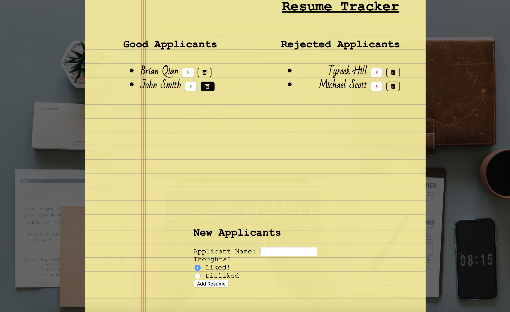

# ResumeTracker

ResumeTracker is my first full-stack application that uses a MySQL database as well as an MVC architecture. There's a Node/Express backend that handles the main routing, a controller that handles the information flow between the database and the site, as well as a custom built ORM. The front end of the site is built with Express Handlebars using pure vanilla Javascript, something I chose to do to help solidify my Javascript fundamentals. While on a surface level this application looks simple, I assure you it was frustrating to get it to this point.

Because this backed by a database, the information will be stored. Note also that each container for names does scroll when category fills up, I haven't found a good way to indicate that.

## Deployed Page

[Deployed on Heroku](https://bq-berkeley-resumetracker.herokuapp.com/)

## Getting Started

For this application, you will need to have Node installed on your computer. More information on Node found [here.](https://nodejs.org/en/). 

### Required Packages

Once Node is installed and the git repository downloaded, you can give the package.json a look and see what dependencies we have listed.
```
  "dependencies": {
    "body-parser": "^1.18.3",
    "express": "^4.16.3",
    "express-handlebars": "^3.0.0",
    "mysql": "^2.16.0",
    "path": "^0.12.7"
  }
```

If all the dependencies match up, we can navigate to the root folder and run:
```
npm install
```

## Images



## Technology used

* Node.js
* Express
* Express Handlebars
* Custom ORM
* MySQL
* Javascript
* HTML/CSS

## Code snippets

```Javascript
//UPDATE FUNCTION
document.querySelectorAll('.change-liked').forEach(changeButton => {
    //Adds an event listener that toggles data attribute for each list item and updates the database accordingly
    changeButton.addEventListener('click', function () {
        let currentAttr = this.getAttribute('data-newliked');
        if (currentAttr) {
            this.setAttribute('data-newliked', "")
            console.log(this.getAttribute('data-id'))
            fetchRequest('api/resumes/' + this.getAttribute('data-id'), 'PUT', {
                resLiked: false
            })
            location.reload()
        } 
    })
})

function fetchRequest(url, method, data) {
    return fetch(url, {
        method,
        headers: {
            "Content-Type": "application/json; charset=utf-8"
        },
        body: JSON.stringify(data)
    }).catch(err => console.log(err))
}
```

``` Javascript
const connection = require('../config/connection.js');

const orm = {
//Sanitized ORM
    create: function (table, info, cb) {
        var queryString = `INSERT INTO ${table} (resName, resLiked) VALUES (?, ?)`;
        connection.query(queryString, info, (err, data) => {
            if (err) throw err;
            cb(data);
        })
    },
    update: function (table, columnObj, id, cb) {
        var queryString = `UPDATE ${table} SET resLiked = ${columnObj.resLiked} WHERE id = ${id}`;
        connection.query(queryString, (err, data) => {
            if (err) throw err;
            cb(data);
        })
    },
 ```

## Learning points

* Syntax, Syntax, Syntax -- double and triple check that you've crossed your t's and dotted your i's
* A data attribute only returns false if it's an empty string, meaning 'false' returns true;
* It's much easier to chain callbacks while focusing on one at a time, keeping in mind all the values and data structures you're using.

## Author

[Brian Qian](https://github.com/brianq0)

## License

MIT